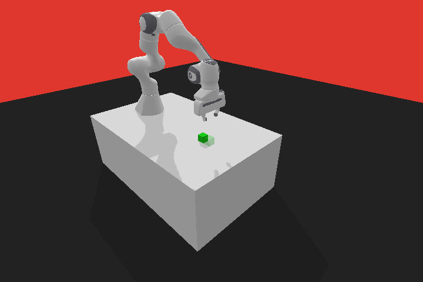
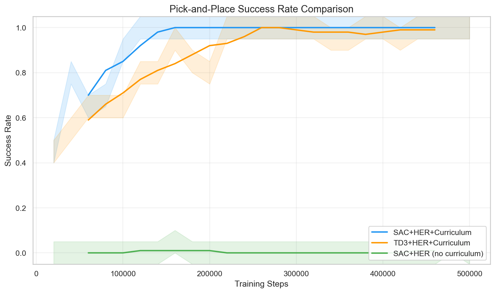
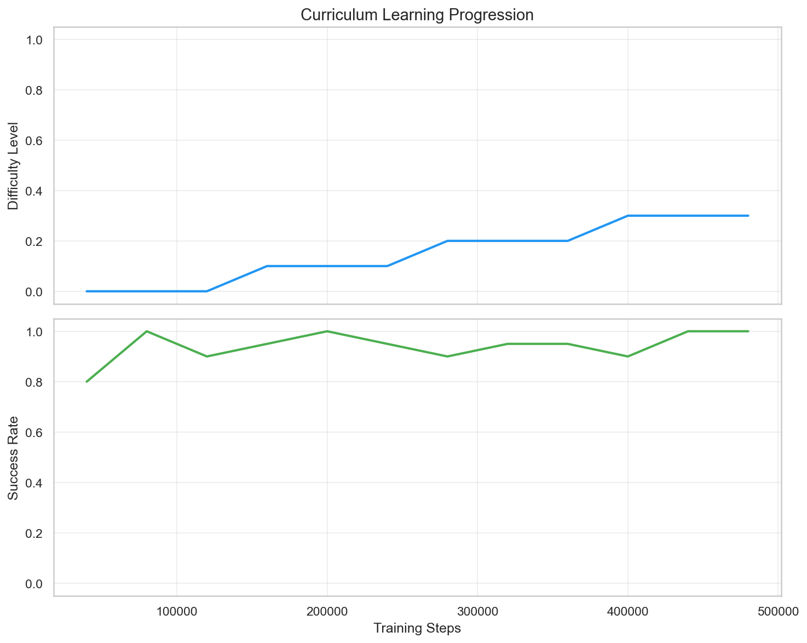
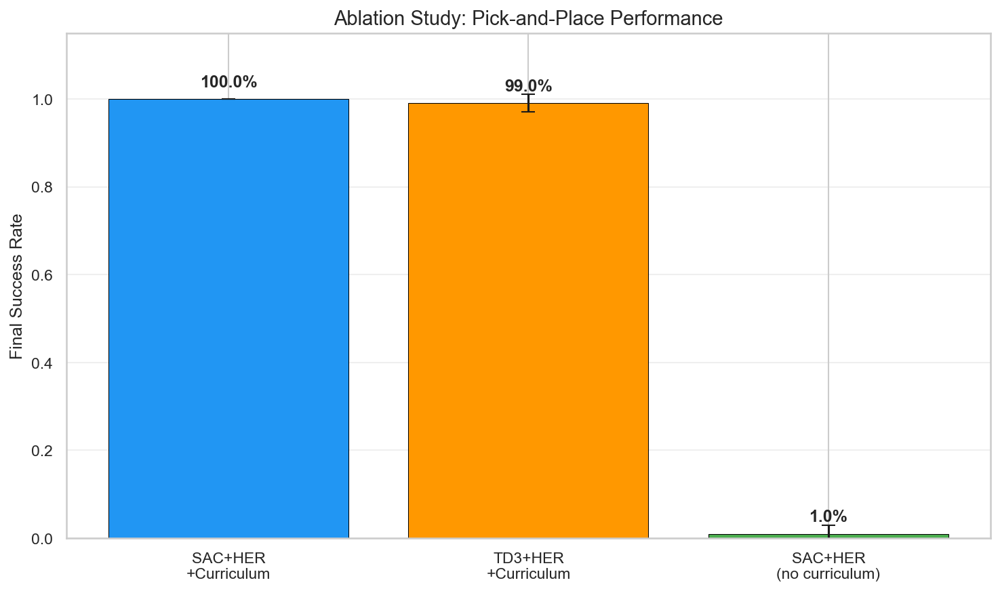

# RL-Panda-Grasp

**Reinforcement Learning for Robotic Pick-and-Place with Adaptive Curriculum Learning**

[中文文档](README_CN.md) | English




## Highlights

- **SAC + Hindsight Experience Replay (HER)** for sparse-reward robotic manipulation
- **Adaptive Curriculum Learning** that automatically progresses task difficulty based on agent performance
- **Comprehensive ablation study**: SAC vs TD3, curriculum vs no-curriculum, HER strategies, reward shaping
- Built on **PyBullet + panda-gym** with custom environment extensions
- Professional code structure with configs, tests, logging, and reproducibility

## Architecture

```
                    ┌──────────────────────────────┐
                    │       CurriculumCallback      │
                    │  (monitors success rate,      │
                    │   adjusts difficulty 0→1)     │
                    └──────────┬───────────────────┘
                               │ set_difficulty()
          ┌────────────────────▼────────────────────────┐
          │        CurriculumPandaPickAndPlaceEnv        │
          │  ┌─────────────┐    ┌────────────────────┐  │
          │  │  Panda Robot │    │ CurriculumPick&Place│  │
          │  │  (7D obs)    │    │ (12D obs, adaptive  │  │
          │  │  (4D action) │    │  goal/obj sampling) │  │
          │  └─────────────┘    └────────────────────┘  │
          │                  PyBullet                     │
          └──────────────────────────────────────────────┘
                               │
          ┌────────────────────▼────────────────────────┐
          │     SAC / TD3  +  HerReplayBuffer            │
          │     (MultiInputPolicy, [256,256,256])        │
          └──────────────────────────────────────────────┘
```

## Results


### Success Rate Comparison


### Curriculum Progression


### Ablation Study


### Ablation Experiments

| Experiment | Algorithm | HER | Curriculum | Purpose |
|------------|-----------|-----|------------|---------|
| E1 (main)  | SAC       | ✓ (future) | ✓ | Main baseline |
| E2         | TD3       | ✓ (future) | ✓ | Algorithm comparison |
| E3         | SAC       | ✓ (future) | ✗ | Curriculum effect |
| E4         | SAC       | ✗ (dense)  | ✗ | HER effect |
| E5         | SAC       | ✓ (final)  | ✓ | HER strategy comparison |

## Quick Start

### Installation

```bash
git clone https://github.com/<your-username>/rl-panda-grasp.git
cd rl-panda-grasp

# Create virtual environment (Python 3.11+ recommended)
python3.11 -m venv venv
source venv/bin/activate

# macOS: pybullet needs compiler warning suppression
CFLAGS="-w" pip install pybullet

# Install project and remaining dependencies
pip install -e ".[dev]"
```

### Train (SAC + HER + Curriculum)

```bash
python -m training.train --config configs/sac_her.yaml
```

### Train (TD3 + HER + Curriculum)

```bash
python -m training.train --config configs/td3_her.yaml
```

### Run Ablation Study

```bash
python -m training.ablation
# Or shorter runs for testing:
python -m training.ablation --timesteps 100000
```

### Evaluate

```bash
python -m evaluation.evaluate --model results/models/sac_her_curriculum/best_model.zip
# Evaluate across difficulty levels:
python -m evaluation.evaluate --model results/models/sac_her_curriculum/best_model.zip --sweep
```

### Record Demo Video

```bash
python -m evaluation.record_video --model results/models/sac_her_curriculum/best_model.zip
```

### Monitor Training (TensorBoard)

```bash
tensorboard --logdir results/logs
```

## Technical Details

### Environment Design

| Space | Shape | Description |
|-------|-------|-------------|
| Observation | (19,) | EE position(3) + velocity(3) + gripper(1) + object pose(6) + object velocity(6) |
| Achieved Goal | (3,) | Object position (x, y, z) |
| Desired Goal | (3,) | Target position (x, y, z) |
| Action | (4,) | EE displacement (dx, dy, dz) + gripper command |

### Reward Function

**Sparse reward** (used with HER):
```python
reward = 0.0 if distance(object, goal) < 0.05 else -1.0
```

### Curriculum Learning

The environment difficulty `d ∈ [0, 1]` controls goal/object sampling ranges:

| Phase | d | Goal XY | Goal Z | Behavior |
|-------|---|---------|--------|----------|
| Reaching | 0.0-0.2 | ±0.05 | 0.00 | Goal at object position |
| Pushing | 0.2-0.5 | ±0.15 | 0.00 | Goal on table, farther away |
| Lifting | 0.5-0.8 | ±0.20 | 0.10 | Goal above table |
| Full P&P | 0.8-1.0 | ±0.30 | 0.20 | Full pick-and-place |

**Adaptive scheduling**: Difficulty increases when success rate > 60% for 3 consecutive evaluations, and decreases if success rate drops below 10%.

### Hindsight Experience Replay

HER relabels failed episodes by substituting the desired goal with the achieved goal, converting failures into successful learning signals. We use the `future` strategy: for each transition, sample 4 goals from future states in the same episode.

### Key Hyperparameters

| Parameter | Value | Rationale |
|-----------|-------|-----------|
| γ (gamma) | 0.95 | Lower than default 0.99; appropriate for short-horizon (50-step) tasks |
| lr | 0.001 | Standard for manipulation tasks (matches rl-baselines3-zoo) |
| Network | [256,256,256] | Three-layer MLP for sufficient expressiveness |
| HER goals | 4 (future) | Standard setting balancing data augmentation and compute |
| Buffer size | 1M | Off-policy algorithms benefit from large replay buffers |

## Project Structure

```
rl-panda-grasp/
├── configs/           # YAML training configurations
├── envs/              # Custom Gymnasium environments
│   ├── curriculum_task.py    # ★ Difficulty-scaled pick-and-place task
│   ├── curriculum_env.py     # Panda env with curriculum support
│   ├── wrappers.py           # Gymnasium wrappers
│   └── env_factory.py        # Vectorized env creation
├── agents/            # RL agent construction
│   ├── builder.py            # SAC/TD3 + HER builder
│   └── callbacks.py          # ★ CurriculumCallback + metrics
├── training/          # Training scripts
│   ├── train.py              # Main training entry point
│   └── ablation.py           # Ablation study runner
├── evaluation/        # Evaluation & visualization
│   ├── evaluate.py           # Model evaluation
│   ├── plot_results.py       # Training curves & plots
│   └── record_video.py       # Demo video recording
├── utils/             # Utilities
├── tests/             # Unit tests
├── scripts/           # Shell scripts
└── results/           # Generated outputs (gitignored)
```

## References

- Andrychowicz et al., *"Hindsight Experience Replay"*, NeurIPS 2017
- Haarnoja et al., *"Soft Actor-Critic: Off-Policy Maximum Entropy Deep RL"*, ICML 2018
- Fujimoto et al., *"Addressing Function Approximation Error in Actor-Critic Methods"* (TD3), ICML 2018
- Gallouédec et al., *"panda-gym: Open-Source Goal-Conditioned Environments for Robotic Learning"*, 2021
- Bengio et al., *"Curriculum Learning"*, ICML 2009

## License

MIT
